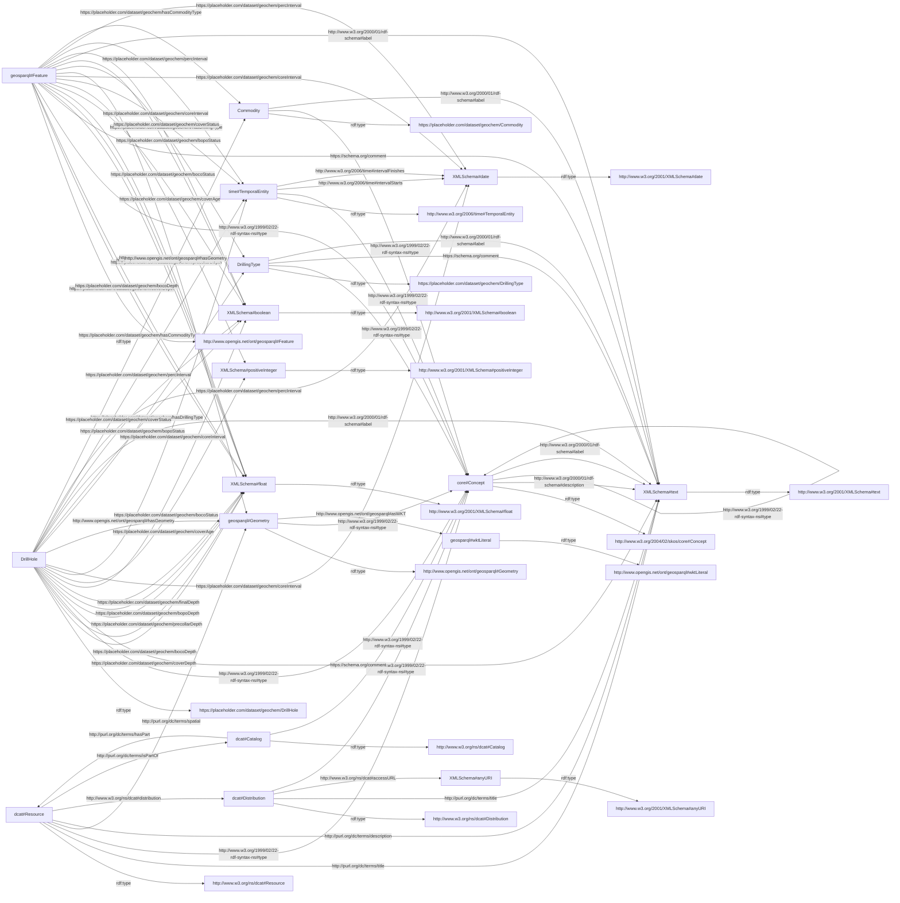

```mermaid
flowchart LR
		A1[XMLSchema#text] -->|rdf:type| http://www.w3.org/2001/XMLSchema#text
		A2[core#Concept] -->|rdf:type| http://www.w3.org/2004/02/skos/core#Concept
		A3[geosparql#Feature] -->|rdf:type| http://www.opengis.net/ont/geosparql#Feature
		A4[XMLSchema#float] -->|rdf:type| http://www.w3.org/2001/XMLSchema#float
		A5[DrillHole] -->|rdf:type| https://placeholder.com/dataset/geochem/DrillHole
		A6[dcat#Resource] -->|rdf:type| http://www.w3.org/ns/dcat#Resource
		A7[dcat#Distribution] -->|rdf:type| http://www.w3.org/ns/dcat#Distribution
		A8[XMLSchema#anyURI] -->|rdf:type| http://www.w3.org/2001/XMLSchema#anyURI
		A9[Commodity] -->|rdf:type| https://placeholder.com/dataset/geochem/Commodity
		B1[DrillingType] -->|rdf:type| https://placeholder.com/dataset/geochem/DrillingType
		B2[geosparql#Geometry] -->|rdf:type| http://www.opengis.net/ont/geosparql#Geometry
		B3[time#TemporalEntity] -->|rdf:type| http://www.w3.org/2006/time#TemporalEntity
		B4[dcat#Catalog] -->|rdf:type| http://www.w3.org/ns/dcat#Catalog
		B5[XMLSchema#date] -->|rdf:type| http://www.w3.org/2001/XMLSchema#date
		B6[XMLSchema#boolean] -->|rdf:type| http://www.w3.org/2001/XMLSchema#boolean
		B7[XMLSchema#positiveInteger] -->|rdf:type| http://www.w3.org/2001/XMLSchema#positiveInteger
		B8[geosparql#wktLiteral] -->|rdf:type| http://www.opengis.net/ont/geosparql#wktLiteral
		A2 -->|http://www.w3.org/2000/01/rdf-schema#description| A1
		A3 -->|https://placeholder.com/dataset/geochem/coverDepth| A4
		A5 -->|https://placeholder.com/dataset/geochem/coverDepth| A4
		A3 -->|https://placeholder.com/dataset/geochem/bocoDepth| A4
		A5 -->|https://placeholder.com/dataset/geochem/bocoDepth| A4
		A6 -->|http://purl.org/dc/terms/title| A1
		A7 -->|http://purl.org/dc/terms/title| A1
		A7 -->|http://www.w3.org/ns/dcat#accessURL| A8
		B4 -->|http://www.w3.org/1999/02/22-rdf-syntax-ns#type| A2
		A5 -->|http://www.w3.org/1999/02/22-rdf-syntax-ns#type| A2
		B1 -->|http://www.w3.org/1999/02/22-rdf-syntax-ns#type| A2
		A3 -->|http://www.w3.org/1999/02/22-rdf-syntax-ns#type| A2
		B2 -->|http://www.w3.org/1999/02/22-rdf-syntax-ns#type| A2
		B3 -->|http://www.w3.org/1999/02/22-rdf-syntax-ns#type| A2
		A6 -->|http://www.w3.org/1999/02/22-rdf-syntax-ns#type| A2
		A9 -->|http://www.w3.org/1999/02/22-rdf-syntax-ns#type| A2
		A7 -->|http://www.w3.org/1999/02/22-rdf-syntax-ns#type| A2
		A2 -->|http://www.w3.org/1999/02/22-rdf-syntax-ns#type| A2
		A3 -->|https://schema.org/comment| A1
		A5 -->|https://schema.org/comment| A1
		B1 -->|https://schema.org/comment| A1
		A3 -->|https://placeholder.com/dataset/geochem/precollarDepth| A4
		A5 -->|https://placeholder.com/dataset/geochem/precollarDepth| A4
		A3 -->|https://placeholder.com/dataset/geochem/bopoDepth| A4
		A5 -->|https://placeholder.com/dataset/geochem/bopoDepth| A4
		B3 -->|http://www.w3.org/2006/time#intervalStarts| B5
		A3 -->|https://placeholder.com/dataset/geochem/finalDepth| A4
		A5 -->|https://placeholder.com/dataset/geochem/finalDepth| A4
		A6 -->|http://purl.org/dc/terms/spatial| B2
		A3 -->|https://placeholder.com/dataset/geochem/bocoStatus| B6
		A5 -->|https://placeholder.com/dataset/geochem/bocoStatus| B6
		A3 -->|https://placeholder.com/dataset/geochem/coverAge| B7
		A5 -->|https://placeholder.com/dataset/geochem/coverAge| B7
		A3 -->|https://placeholder.com/dataset/geochem/coreInterval| B3
		A3 -->|https://placeholder.com/dataset/geochem/coreInterval| B5
		A5 -->|https://placeholder.com/dataset/geochem/coreInterval| B3
		A5 -->|https://placeholder.com/dataset/geochem/coreInterval| B5
		A3 -->|http://www.opengis.net/ont/geosparql#hasGeometry| B2
		A5 -->|http://www.opengis.net/ont/geosparql#hasGeometry| B2
		B3 -->|http://www.w3.org/2006/time#intervalFinishes| B5
		B2 -->|http://www.opengis.net/ont/geosparql#asWKT| B8
		A6 -->|http://purl.org/dc/terms/description| A1
		A3 -->|https://placeholder.com/dataset/geochem/hasDrillingType| B1
		A5 -->|https://placeholder.com/dataset/geochem/hasDrillingType| B1
		A6 -->|http://www.w3.org/ns/dcat#distribution| A7
		A3 -->|https://placeholder.com/dataset/geochem/bopoStatus| B6
		A5 -->|https://placeholder.com/dataset/geochem/bopoStatus| B6
		B4 -->|http://purl.org/dc/terms/hasPart| A6
		A5 -->|http://www.w3.org/2000/01/rdf-schema#label| A1
		B1 -->|http://www.w3.org/2000/01/rdf-schema#label| A1
		A3 -->|http://www.w3.org/2000/01/rdf-schema#label| A1
		A9 -->|http://www.w3.org/2000/01/rdf-schema#label| A1
		A2 -->|http://www.w3.org/2000/01/rdf-schema#label| A1
		A3 -->|https://placeholder.com/dataset/geochem/coverStatus| B6
		A5 -->|https://placeholder.com/dataset/geochem/coverStatus| B6
		A3 -->|https://placeholder.com/dataset/geochem/percInterval| B3
		A3 -->|https://placeholder.com/dataset/geochem/percInterval| B5
		A5 -->|https://placeholder.com/dataset/geochem/percInterval| B3
		A5 -->|https://placeholder.com/dataset/geochem/percInterval| B5
		A6 -->|http://purl.org/dc/terms/isPartOf| B4
		A3 -->|https://placeholder.com/dataset/geochem/hasCommodityType| A9
		A5 -->|https://placeholder.com/dataset/geochem/hasCommodityType| A9
```