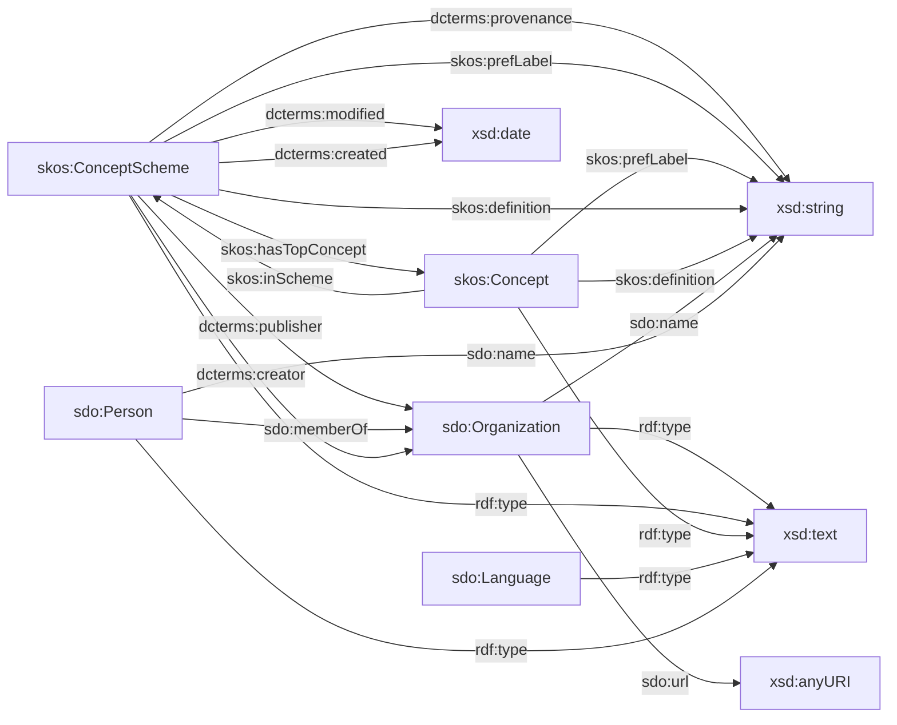

```mermaid
flowchart LR
		A1[skos:ConceptScheme]
		A2[xsd:string]
		A3[skos:Concept]
		A4[sdo:Organization]
		A5[xsd:date]
		A6[xsd:text]
		A7[sdo:Language]
		A8[sdo:Person]
		A9[xsd:anyURI]
		A1 -->|dcterms:provenance| A2
		A1 -->|skos:prefLabel| A2
		A3 -->|skos:prefLabel| A2
		A1 -->|dcterms:publisher| A4
		A1 -->|skos:definition| A2
		A3 -->|skos:definition| A2
		A1 -->|dcterms:modified| A5
		A4 -->|rdf:type| A6
		A1 -->|rdf:type| A6
		A3 -->|rdf:type| A6
		A7 -->|rdf:type| A6
		A8 -->|rdf:type| A6
		A4 -->|sdo:name| A2
		A8 -->|sdo:name| A2
		A8 -->|sdo:memberOf| A4
		A4 -->|sdo:url| A9
		A1 -->|skos:hasTopConcept| A3
		A1 -->|dcterms:creator| A4
		A1 -->|dcterms:created| A5
		A3 -->|skos:inScheme| A1
```